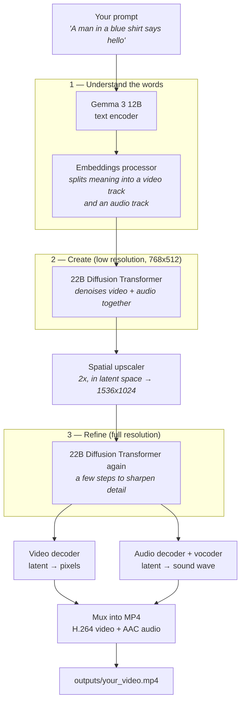

# LTX-2.3 Setup — How It Works

A plain-language guide to what is installed in `/home/naresh/ltx-2.3`, how a video actually gets
made, and how long it takes.

---

## 1. What this system does

You give it **a sentence of text**. It gives you back **an MP4 with picture and sound already in
sync** — including speech that matches the lip movements.

That last part is the unusual bit. Most video generators make silent video and you add audio later.
LTX-2.3 generates the video and the audio *at the same time, in the same model*, so they line up by
construction.

The model is **22 billion parameters** and runs on **one H100 GPU**.

---

## 2. What is on disk

```
/home/naresh/ltx-2.3/
├── generate.sh              ← the script you actually run
├── generate_worker.sh       ← one GPU's worth of batch/variations work; launched by generate.sh
├── generate_interactive.sh  ← the wizard; sourced by generate.sh when run with no arguments
├── LTX-2/                   ← the source code (cloned from Lightricks/LTX-2)
│   ├── .venv/               ← Python environment (7.8 GB, torch 2.9.1 + CUDA 12.8)
│   └── packages/
│       ├── ltx-core/        ← the model itself (transformer, VAE, loaders)
│       ├── ltx-pipelines/   ← the recipes that chain steps together  ← you use these
│       ├── ltx-trainer/     ← fine-tuning / LoRA training (not used for generation)
│       └── ltx-kernels/     ← optional fast CUDA kernels (not built, not needed)
├── models/                  ← 117 GB of weights
│   ├── ltx-2.3/
│   │   ├── ltx-2.3-22b-dev.safetensors                    46 GB  ← quality model
│   │   ├── ltx-2.3-22b-distilled-1.1.safetensors          46 GB  ← fast model
│   │   ├── ltx-2.3-22b-distilled-lora-384-1.1.safetensors 7.6 GB ← stage-2 polish
│   │   └── ltx-2.3-spatial-upscaler-x2-1.1.safetensors    1.0 GB ← 2x upscaler
│   └── gemma-3-12b/                                       23 GB  ← reads your prompt
├── outputs/                 ← finished videos land here
└── logs/                    ← job logs from previous runs
```

The two 46 GB files are **two different versions of the same model**. `dev` is the original.
`distilled` is a speed-optimised copy that reaches a similar result in far fewer steps. You pick one
per run; they are never both loaded.

---

## 3. The big picture



---

## 4. The components, one by one

### Gemma 3 12B — the reader
Google's language model. It reads your prompt and turns it into numbers that carry meaning. This is
*only* used to understand text; it does not draw anything.

### Embeddings processor — the translator
A small piece that lives **inside** the LTX checkpoint. It takes Gemma's output and splits it into
two separate instruction sets: one describing what the **picture** should look like, one describing
what the **sound** should be. This split is what lets one model drive both.

### The 22B Diffusion Transformer — the artist
The heart of the system. Confirmed from the checkpoint config:

| Property | Value |
|---|---|
| Layers | 48 |
| Video attention heads | 32 × 128 dims |
| Audio attention heads | 32 × 64 dims |
| Audio↔video cross-attention | enabled |
| Position encoding | RoPE |
| Precision | bfloat16 |

**How diffusion works, simply:** it starts with pure random static and removes a bit of the noise on
each pass. After enough passes the static has resolved into a coherent video. Each pass is one
"step" — that is the number you see in the progress bar.

**The important design choice:** video and audio are denoised in the *same* pass, and the layers
have cross-attention between the two. The picture can "see" the sound and the sound can "hear" the
picture. That is why lip-sync works instead of drifting.

### Spatial upscaler — the enlarger
Doubles the resolution. It works on the compressed latent representation, not on pixels, so it is
small (1 GB) and fast.

### Video decoder (VAE) — the developer
The transformer never works in pixels; it works in a compressed space that is **8× smaller in time
and 32× smaller in each spatial direction**. So a 1536×1024 video of 121 frames is, inside the
model, only 16 frames of a 48×32 grid. The decoder expands that back into real frames.

This compression is the main reason a 5-second HD video is affordable at all.

### Audio decoder + vocoder — the speaker
Same idea for sound: audio latents → spectrogram → actual waveform.

### `encode_video` — the packager
Muxes the frames and the waveform into a single MP4 (H.264 + AAC).

---

## 5. Two clever tricks worth understanding

### Trick 1: draw small, then enlarge

Generation happens at **half resolution first** (768×512), then gets upscaled and touched up at full
resolution (1536×1024).

Why: the expensive part of a transformer grows steeply with the number of pixels. Doing the hard
creative work at quarter the pixel count, then spending only 3 cheap steps at full size, is far
faster than working at full size the whole way — and the result looks nearly the same.

### Trick 2: one model in memory at a time

Add it up: the 22B transformer is ~44 GB in bf16, Gemma is ~23 GB, plus VAEs and upscaler. That is
well over the 80 GB on an H100.

It fits anyway because of a pattern in
[`blocks.py`](LTX-2/packages/ltx-pipelines/src/ltx_pipelines/utils/blocks.py): **each stage builds
its model, uses it, and immediately frees the GPU memory.** Gemma loads, encodes your prompt, and is
gone before the transformer ever loads.

```
load Gemma → encode prompt → free Gemma
    → load transformer → denoise stage 1 → free transformer
    → load upscaler → upscale → free upscaler
    → load transformer → denoise stage 2 → free transformer
    → load decoders → decode → free decoders
```

The trade-off is the reason runs feel slow to start: those 46 GB weights get read **twice** per run,
once per stage. See the timing section.

---

## 6. Fast mode vs Quality mode

`generate.sh` gives you two paths. They share the same skeleton and differ in the middle.

| | **fast** (default) | **`--quality`** |
|---|---|---|
| Pipeline | `ltx_pipelines.distilled` | `ltx_pipelines.ti2vid_two_stages` |
| Checkpoint | distilled | dev |
| Stage 1 steps | 8 | 30 |
| Stage 2 steps | 3 | 3 |
| Guidance | none | CFG 3.0 + STG, negative prompt |
| Stage 2 extra | — | distilled LoRA fused at strength 0.8 |

**"Guidance"** means the model runs the scene more than once per step — once following your prompt,
once ignoring it — and exaggerates the difference. It improves prompt accuracy and detail, and it is
a large part of why quality mode costs more per step.

Rule of thumb: **use fast for iterating on a prompt, quality for the final take.**

---

## 7. How to use it

### Just run it — interactive mode

```bash
cd /home/naresh/ltx-2.3
./generate.sh
```

With no arguments, `generate.sh` walks you through everything: load your prompt from a file or
type it (either way, it prints the prompt back so you can check it), an optional image to use as
the first frame — if you give one, it's fully decoded on the spot so a truncated or corrupt file
is caught immediately, and you're asked whether it should be cropped or padded to fit the video —
orientation (landscape or portrait), length in seconds, how many variations and how many GPUs,
fast or quality, any extra flags, then a full summary with a **Proceed? [y/N]** gate — nothing is
submitted until you confirm. At the end it prints the equivalent one-line command, so you can skip
the wizard next time you want the same thing.

### One video

```bash
./generate.sh "Your detailed prompt here"
```

Prompts get long — you don't have to type one inline. Save it to a file instead:

```bash
./generate.sh --prompt-file my_prompt.txt --quality
```

`--prompt-file` reads the whole file and collapses all whitespace (including newlines) into one
paragraph, so you can wrap a long, multi-sentence prompt across editor lines for readability
without that affecting what the model sees. A relative path (for `--prompt-file`, `--prompts-file`,
`--image`, `--output-path`, or `--output-dir`) is always resolved from this project's root
directory, not from whatever directory you ran the command from.

The video is written to `outputs/` with a timestamped name. Add `--quality` for the better version:

```bash
./generate.sh "Your prompt" --quality --output-path outputs/final.mp4
```

Default output is **1920×1088 landscape (YouTube-style), 121 frames at 24fps — about 5 seconds**.
Use `--orientation portrait` for a 1088×1920 Shorts/Reels-style video instead, or `--duration N` for
a different length in seconds (converted to the nearest valid frame count automatically):

```bash
./generate.sh "Your prompt" --orientation portrait --duration 8
```

### Same prompt, several takes — to compare and pick the best

```bash
./generate.sh --prompt-file my_prompt.txt --variations 4 --gpus 4
```

Generates 4 takes of the *same* prompt with different seeds (`base_seed, base_seed+1, ...` —
override the start with `--base-seed`), so you can compare and keep the best one. `--gpus`
controls whether they run one at a time (`1`, the default — series) or at the same time (up to
`8` — parallel); it's the same flag batch mode uses below, just applied to variations of one
prompt instead of several different scenes. Output is
`outputs/variations-<timestamp>/variant_001.mp4 ... variant_NNN.mp4`, with the same per-item logs,
auto-retry on preemption, and `--output-dir` resume support as batch mode.

### Many different scenes, in parallel across GPUs

For several *different* scenes, write them into a text file — one scene per **blank-line-separated
block**, so each scene's prompt can span multiple lines — and add `--gpus`. Each GPU runs its own
independent copy of the pipeline; this is not one video split across GPUs, it is several videos
generated at the same time, one per GPU:

```bash
cat > scenes.txt <<'EOF'
# lines starting with # are comments, dropped wherever they appear
A golden retriever puppy runs across a sunlit lawn, tongue out, tail
wagging as it chases a tennis ball.

A chef in a white uniform plates a dessert in a busy restaurant kitchen,
steam rising from the pan behind her.

A cyclist rides down a coastal road at sunset, waves crashing on the left.
EOF

./generate.sh --prompts-file scenes.txt --gpus 8
```

Blank lines separate scenes; each scene's own lines are joined into one paragraph the same way
`--prompt-file` does. This creates `outputs/scenes-<timestamp>/` containing `scene_001.mp4`,
`scene_002.mp4`, ..., a saved copy of the parsed prompt list as `prompts.txt`, and a per-scene log
under `logs/`. `--gpus` accepts 1 to 8; the launcher tries to fit all workers on one Slurm node
first (weight loading is faster there — see [§10](#10-things-worth-knowing)), and spreads across
nodes only if a single node with that many free GPUs is not available within
`LTX_SAME_NODE_WAIT` seconds (default 60).

Since the batch runs on the pre-emptible `background` partition (see below), a batch can be
interrupted partway through. `generate.sh` retries automatically — up to `LTX_MAX_ATTEMPTS` times
(default 3) — relaunching only the scenes that are not yet finished. If scenes are still
unfinished when it gives up, it prints the exact command to resume:

```bash
./generate.sh --prompts-file scenes.txt --gpus 8 --output-dir outputs/scenes-20260924-172000
```

Resuming requires the same prompts file content as the original run, so scene numbers stay
stable. A scene that failed outright (a real error, not a preemption) is not retried
automatically within one run — that would burn attempts on a prompt that is not going to
succeed — but a manual `--output-dir` resume does give it one more try, in case the failure
was transient.

### Useful flags

Anything `generate.sh` does not recognise is passed straight through to the underlying pipeline:

| Flag | What it does |
|---|---|
| `--duration 8` | Length in seconds. Converted to the nearest valid `--num-frames` automatically. |
| `--orientation portrait` | `landscape` (1920×1088, default) or `portrait` (1088×1920). |
| `--seed 7` | Same seed + same prompt = same video. Change it to get a different take. |
| `--num-frames 241` | Longer clip (~10s), as an exact frame count instead of `--duration`. Must be `8 × K + 1`. |
| `--height 1024 --width 1536` | Exact resolution instead of `--orientation`. Must be divisible by 64. |
| `--image photo.jpg 0 1.0` | Image-to-video: animate a still. Args are `PATH FRAME_INDEX STRENGTH`. |
| `--image-fit pad` | Fit `--image` without cropping: scale it down and add black bars instead. Default `crop`. |
| `--enhance-prompt` | Let the model rewrite your prompt into a richer one first. |
| `--quantization fp8-cast` | Use less VRAM (only needed if you hit an out-of-memory error). |

Full list: `LTX-2/.venv/bin/python -m ltx_pipelines.distilled --help`

### Writing a good prompt

The model responds to **cinematographic description**, not keyword lists. Write one flowing
paragraph: the action first, then appearance, then background, then camera movement and lighting.
Put spoken dialogue in quotes and it will be voiced with matching lip movement. Keep it under
roughly 200 words.

### Where it runs

There are **no usable GPUs on the login node** — its CUDA driver is a stub. `generate.sh` handles
this for you: it wraps the job in `srun` and requests GPUs from the Slurm cluster (150 nodes,
8× H100 80GB each). The script blocks until the video (or the whole batch) is finished.

The default partition is **`background`** — a hidden, low-priority partition. It shares the same
nodes as `main`, but anything running there can be **preempted at any moment**, with no grace
period, if higher-priority work needs the GPU. That trade-off is deliberate: this workload is not
latency-critical, so it is a reasonable place to leave it, and batch mode is built to tolerate
being killed and resumed (see above). Single-video mode does **not** auto-retry on preemption — if
a lone job gets preempted, just rerun the command. Override with `LTX_PARTITION=main` if you need
to skip the preemption risk for a one-off run.

For long runs, start it inside `tmux` so an SSH disconnect does not kill it.

You can override the allocation with environment variables:
`LTX_PARTITION` (default `background`), `LTX_TIME` (default `01:00:00` for one video, or
auto-computed per attempt in batch mode), `LTX_MEM_PER_GPU` (default `96G`), `LTX_CPUS` (default
`8`, per GPU), `LTX_SAME_NODE_WAIT` (default `60` seconds), `LTX_MAX_ATTEMPTS` (default `3`,
batch mode only).

---

## 8. How long does it take

These are **real measured numbers** from the two verified test runs on this cluster
(Slurm jobs 414218 and 414222), at 1536×1024, 121 frames, 24fps, one H100.

The current default is now 1920×1088 landscape (see [§7](#7-how-to-use-it)), about **33% more
pixels** than the 1536×1024 these numbers were measured at. Resolution cost is worse than linear
(see below), so expect the real numbers to be somewhat higher than shown here; this has not been
re-measured on this cluster.

| Mode | GPU compute | **Total wall clock** |
|---|---|---|
| fast | ~25 seconds | **3 min 40 sec** |
| `--quality` | ~70 seconds | **4 min 43 sec** |

### Why the total is so much bigger than the compute

Roughly **3 minutes of every run is just loading weights** from the shared network filesystem — the
46 GB checkpoint is read once for stage 1 and again for stage 2, plus 23 GB of Gemma. That overhead
is fixed: it does not shrink when you make a shorter video.

The denoising itself is timed in the logs. Everything else is loading, which the logs do not
timestamp individually — so it is shown below as one lumped remainder rather than split per model:

| Phase | fast | quality |
|---|---|---|
| **Stage 1 denoising** *(measured)* | 6.6 s — 8 steps | 58 s — 30 steps @ 1.86 s/step |
| **Stage 2 denoising** *(measured)* | 8.8 s — 3 steps | 8.8 s — 3 steps |
| Decode video + audio *(measured)* | ~1 s | ~1 s |
| Loading weights + writing MP4 *(remainder)* | ~3 min 15 s | ~3 min 35 s |

The loading remainder is nearly identical in both modes, which is what you would expect: the same
volume of weights is read either way. Quality mode's extra ~20 seconds is most likely the 7.6 GB
distilled LoRA being fused into the transformer for stage 2.

### Practical expectations

- **Budget 4–5 minutes per video**, either mode. The mode barely changes the total.
- Add **queue wait** on top. The cluster is busy; one GPU usually schedules quickly, but it is not
  guaranteed.
- **Longer videos cost more.** Roughly linear in frame count — a 10-second clip roughly doubles the
  denoising time, though the ~3 min loading overhead stays flat.
- **Higher resolution costs more than linearly**, because attention grows faster than pixel count.

The takeaway: since loading dominates, **quality mode is nearly free**. It adds about a minute to a
four-minute job. Unless you are rapidly iterating, there is little reason not to use `--quality`.

### Many scenes at once

`--gpus N` runs N scenes in parallel instead of one at a time, so a batch of 8 scenes on `--gpus 8`
takes roughly as long as a single video does today (plus a little scheduling overhead) — not 8×
the time. If all workers land on the same node, later ones may load weights a bit faster than the
first, since the shared filesystem read is warm in the node's page cache (see
[§10](#10-things-worth-knowing)); this has not been measured on this cluster, though.

---

## 9. Quick reference

| I want to... | Do this |
|---|---|
| Not type flags at all | `./generate.sh` (interactive wizard) |
| Make a video | `./generate.sh "prompt"` |
| Use a long prompt from a file | `./generate.sh --prompt-file my_prompt.txt` |
| Make a better video | `./generate.sh "prompt" --quality` |
| Get a different take | add `--seed 123` |
| Compare several takes of one prompt | `./generate.sh --prompt-file p.txt --variations 4 --gpus 4` |
| Make a portrait video (Shorts/Reels) | add `--orientation portrait` |
| Make it longer or shorter | add `--duration 8` (seconds) |
| Make it longer or shorter, as an exact frame count | add `--num-frames 241` (must be 8K+1) |
| Animate a photo | add `--image photo.jpg 0 1.0` |
| Make several different scenes in parallel | `./generate.sh --prompts-file scenes.txt --gpus 8` |
| Resume an interrupted batch/variations run | `./generate.sh --prompts-file scenes.txt --gpus 8 --output-dir outputs/scenes-.../` |
| See all options | `LTX-2/.venv/bin/python -m ltx_pipelines.distilled --help` |
| Check a running job | `squeue -u $USER` |
| Read a past run | look in `logs/` (single video) or the run's own `logs/` (batch/variations) |
| Fix out-of-memory | add `--quantization fp8-cast --offload cpu` |
| Skip the preemption risk for one run | `LTX_PARTITION=main ./generate.sh "prompt"` |

---

## 10. Things worth knowing

**One GPU per video is the right answer — parallel GPUs help by running more videos, not by
splitting one.** `ltx-pipelines/docs/multigpu/` documents a different feature: splitting a *single*
generation across GPUs to reduce its *latency*. That does not let you fit a bigger model, because
every GPU holds a full copy of the transformer, and it needs the optional `ltx-kernels` CUDA
extension built, which is not built here. `generate.sh --gpus N` is not that — it is N independent
single-GPU pipelines running at once, one scene each, which is the effective way to use several
GPUs for this workload.

**Batch mode does not keep the model loaded between scenes.** Each scene still pays the full ~3
minutes of weight loading described in [§8](#8-how-long-does-it-take); `--gpus N` only overlaps
that cost across N scenes instead of removing it. Keeping the model resident across scenes within
one process — sharing it via the loader's `Registry` and `DiffusionStage.run()` — would cut a
single worker's per-scene time roughly 8×, and combines multiplicatively with `--gpus`, but is a
separate change from this one.

**The trainer is unused.** `packages/ltx-trainer/` is for fine-tuning the model on your own footage
(LoRA or full). It is a separate workflow with its own data-preprocessing pipeline, and it needs
80 GB per GPU. Nothing in the generation path touches it.

**Attention runs on PyTorch SDPA.** FlashAttention 3 is not installed, so the model falls back to
PyTorch's built-in attention (the logs confirm `SDPA[CUDNN_ATTENTION>...]`). This works fine. On
H100 hardware a FlashAttention 3 wheel would speed up the denoising steps — but since denoising is
only ~25–70 seconds of a ~4 minute job, it would barely move the total. Not worth the setup unless
the loading overhead is solved first.

**Storage is the real constraint.** The models are 117 GB and the environment is another 7.8 GB.
Outputs are small (a few MB each), but they accumulate in `outputs/`.

**The code is pinned.** `LTX-2/` sits on commit `4f89057`, chosen because it pairs with torch 2.9.1
built for CUDA 12.8, which matches this cluster's NVIDIA driver (570.158.01). Upgrading the repo may
pull in a newer CUDA build that this driver will not run.

**`--prompts-file` scenes are separated by blank lines, not by every line.** This lets a scene's
prompt span multiple editor lines (joined into one paragraph), which is worth knowing if you
recall an earlier version of this script that treated every non-blank line as its own scene: a
file with no blank lines between entries now parses as one merged scene rather than several.

**Every `--image` is fully decoded before anything is submitted, not just its header.**
`Image.open()` alone only reads a PNG/JPEG header, which still looks valid even in a file that got
cut off partway through uploading — dimensions and all. `generate.sh` forces a full decode of any
`--image` up front, so a truncated or otherwise corrupt file is caught on the login node in about a
second, with a clear message telling you to re-upload it, instead of after a Slurm job has already
loaded the models and started running.
