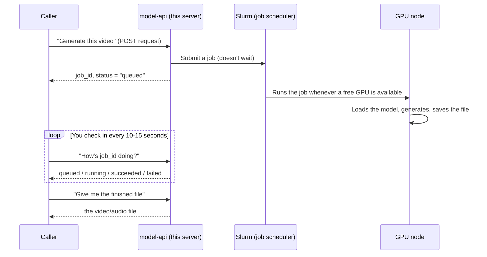

# Model API — Status Report

_A plain-language snapshot of where things stand. Last checked: 2026-09-29._

## TL;DR

- There is now **one shared API** (`model-api/`) instead of an API buried inside `ltx-2.3/`.
- It can actually **do** three things today: generate video/audio through **LTX-2.3**, swap a character into an existing video through **Wan-Animate v1** (`Wan2.2-Animate-14B`, "replace" mode), and convert an existing recording to one of a curated set of voices through **RVC** (via the Applio fork). All three are built and tested, including a real, full, start-to-finish run each for Wan-Animate v1 and RVC (LTX-2.3's own end-to-end run is still the one open item — see below).
- **MAGI-2.2 is not wired in yet.** No endpoints for it exist. It needs real new work, described below — this is not a small config change.
- **Qwen3-VL is no longer in this workspace at all** — its folder is gone (not something done as part of this API work). It's out of scope until/unless it comes back.
- **The API server is not currently running** — no `tmux` session, no process on port 8012 (checked directly; likely stopped between sessions, e.g. an environment restart, rather than anything about the code itself). See below for the one command that starts it.
- **New in this session: a web UI at `/ui/`** (React, built with `npm run build` under `model-api/ui/`, served by this same FastAPI process) that exposes every currently-wired recipe through plain forms — LTX-2.3's 5 recipes and Wan-Animate v1's replace mode — plus a live jobs list with cancel/preview/download. It's a pure client of this same API: no new generation logic, no new validation beyond basic form checks — see `ui/README.md`. Also new: a read-only `GET /v1/jobs` endpoint (the most recent jobs across every backend, each with its original request body) that the UI's jobs list is built on top of — usable directly too, not just from the UI.
- **Also new: better visibility into a queued/running job.** Every job now reports `typical_run_seconds`/`typical_basis` (median of recent real runs of that exact pipeline, falling back to a documented per-backend estimate), and `wan-animate:replace` jobs additionally report live `progress` — which stage, which clip/step, and a rough time-remaining estimate — read straight out of that job's own log file. Every other pipeline still reports `progress: null`; that's expected, not a regression.
- **New: a third backend, RVC (voice conversion).** One endpoint, `POST /v1/rvc/convert` — converts an existing recording to sound like one of a small, curated, pre-installed set of voices while keeping that recording's own delivery (timing, pauses, emotion) intact; `GET /v1/rvc/voices` lists what's currently installed. Built on the actively-maintained Applio fork of RVC (MIT-licensed). Actually tested start to finish on real cluster GPU time, same bar as Wan-Animate v1 below. See its own section 5 write-up for what's installed and what was found/fixed along the way.
- **New in this session: RVC batch conversion.** A second RVC endpoint, `POST /v1/rvc/batch-convert` — converts several recordings to the same installed voice in a single Slurm job (one queue wait for the whole set, not one per file), returning one `output.zip`. All-or-nothing: one bad file fails the whole batch. Built on Applio's own `core.py batch-infer` through a new wrapper script (`run_batch.py`) that fixes three real gaps in Applio's own batch code, plus a real naming trap (the CLI command is `batch-infer`, hyphenated — not `batch_infer`, the Python function's own name) hit and fixed via a real end-to-end run, not guessed at up front. Also new: a web UI tab for it, and along the way, a real pre-existing bug fixed in the UI's own result preview (an `rvc:convert` result was rendering as a silent `<video>` tagged `.mp4` instead of a playable `<audio>` tagged with its real `export_format`). See its own write-up under the RVC section of §5.
- **New in this session: live partition availability, and a job-name prefix.** A new read-only endpoint, `GET /v1/partitions`, reports each Slurm partition's free GPUs, how many GPUs the pre-emptible `background` partition is currently borrowing from it (reclaimable by pre-emption), and how many jobs are queued for it — read straight from `scontrol`/`squeue` and cached for up to 20 seconds. The web UI's `partition` field now shows this live, with a plain-text fallback if the endpoint is ever unreachable. Separately, every Slurm job this API submits (on every backend) now gets its `--job-name` prefixed with `data-validation-` (e.g. `data-validation-ltx23-api-<id>`), so it's identifiable in `squeue`/`sacct` output alongside unrelated jobs on this shared cluster — see `common/config.py`'s `SLURM_JOB_NAME_PREFIX` (env-overridable via `MODEL_API_SLURM_JOB_NAME_PREFIX`).
- **New (2026-10-09): a fifth backend, LTX-2.5**, running alongside the unchanged LTX-2.3 backend. Three endpoints, `POST /v1/ltx25/videos/generate` (text/image-to-video, `fast` or `quality`, optional `auto_duration`), `POST /v1/ltx25/videos/interpolate` (give it a first and a last frame — added later the same day) and `POST /v1/ltx25/videos/retake`, plus an "LTX-2.5" group in the web UI. Its headline feature is **native multi-shot** (several cuts inside one clip, same character/voice/lighting) — written into the prompt, no separate field. Installed as its own project (`ltx-2.5/`, own venv), because it needs a newer `transformers` than LTX-2.3's pinned environment can take. Tested for real, twice: an 8-job pilot straight on the GPUs, then one `fast`, one `quality` and one `retake` job through the real API. See §5's LTX-2.5 section — including one real defect found and worked around (the diffusion video decoder corrupts the tail of a 10-second clip on this cluster).

---

## 1. What "model-api" actually is

Think of it as a **reception desk** that sits in front of the GPU cluster. Instead of every video-generating program having its own separate front door, there's now one door (`model-api/`), and each program (LTX-2.3, Wan-Animate v1, and later MAGI-2.2) has its own hallway behind that door.

Concretely, it's a small Python web server (built with a framework called **FastAPI**, run by a program called **uvicorn**). It doesn't generate anything itself — it just:

1. Takes in a request ("make me this video"),
2. Hands the real work off to the cluster's job scheduler (**Slurm**) to run on an actual GPU,
3. Keeps track of that job's status so you can check on it later,
4. Lets you download the finished file once it's done.

## 2. Is it running right now?

**No** — checked directly: no `tmux` session, no `uvicorn` process, nothing listening on port 8012. Everything else in this document (jobs.db, past job history, the new web UI's build) is still there on disk; only the running process itself is gone, so this is a plain start, not a crash to debug. Same command either way:

```bash
cd /home/naresh/Vision/model-api
./run.sh
```

This starts it inside a `tmux` session (so it keeps running after you disconnect), and prints how to attach/stop it plus the web UI's URL. You'd then reach both the API and `/ui/` over an SSH tunnel (`ssh -L 8012:localhost:8012 ...`) — neither is exposed to the open internet. There's still no auto-start on boot or auto-restart if it crashes or the environment restarts again later, same as before.

## 3. How a request actually gets served



Nothing here is instant — every request is a real GPU job, so it always takes at least a few minutes, sometimes much longer if the cluster is busy or the model itself is slow (more on that below).

## 4. Which services can you actually call through it today?

| Service | Callable through the API today? | How it really runs |
|---|---|---|
| **LTX-2.3** (video + audio generation) | **Yes** — 5 endpoints, all under `/v1/ltx/...` | 1 GPU per job, a few minutes each |
| **LTX-2.5** (video + audio generation, native multi-shot) | **Yes** — 3 endpoints, `/v1/ltx25/videos/generate`, `/v1/ltx25/videos/interpolate` and `/v1/ltx25/videos/retake` | 1 GPU per job, ~4.5-10 minutes each (mostly weight loading) |
| **Wan-Animate v1** (character replacement in existing video) | **Yes** — 1 endpoint, `/v1/wan-animate/videos/replace` | 1 GPU per job, ~25 minutes for a ~7s clip (scales with clip length) |
| **RVC** (voice conversion — one recording at a time, or several in one batch) | **Yes** — 3 endpoints, `/v1/rvc/convert`, `/v1/rvc/batch-convert`, and `/v1/rvc/voices` | 1 GPU per job, ~1 minute for a ~10s clip (scales with clip length, and for a batch, with file count — files are converted one at a time, not in parallel) |
| **Parakeet** (speech transcription — word- and segment-level timestamps) | **Yes** — 1 endpoint, `/v1/parakeet/transcribe` | 1 GPU per job, ~65-120s end to end for anything from a 10s clip to a 35-min chunked recording (node assignment affects timing more than length, in a small sample) |
| **Breeze TTS 2** (text-to-speech — voice design, clone, direction; English + Chinese) | **Yes** — 1 endpoint, `/v1/breeze-tts/synthesize` | 1 GPU per job, ~20s (warm node) to ~70s (cold node) for a short sentence; ~170s for a 1000-character passage (~92s of audio). Weights are research / non-commercial use only |
| **MAGI-2.2** (10-second video + audio) | **No** — not wired in at all | Would need a whole 8-GPU node per job, ~20-30 min each |
| **Qwen3-VL** | **N/A** — its folder isn't in this workspace anymore | Was a separate always-on server (vLLM), unrelated to this API |

Every one of the "Yes" rows above is also reachable through **a web UI at `/ui/`** — plain forms instead of hand-written HTTP requests, backed by this exact same API (§1's diagram still applies underneath: it's still a real GPU job either way, still takes minutes at minimum). MAGI-2.2 and Qwen3-VL have no UI tab either, for the same reason they have no endpoint yet.

Plus, no matter which service you're calling (or whether you're using the UI or calling the API directly), everyone shares:
- `POST /v1/uploads` — upload a file once, get an ID back to reference it later.
- `GET /v1/jobs` — list the most recent jobs across every backend (new — added for the web UI's jobs list, but usable directly too).
- `GET /v1/jobs/{id}` — check a job's status.
- `GET /v1/jobs/{id}/result` — download the finished file.
- `DELETE /v1/jobs/{id}` — cancel a job.
- `GET /v1/health` — "is the server alive?"
- `GET /v1/partitions` — live per-partition GPU availability and queue length, for choosing a `partition` before submitting (new this session).

## 5. What it would take to add each service

### LTX-2.3 — ✅ done (with one caveat)

All 5 of its endpoints (`generate`, `keyframe-interpolation`, `audio-to-video`, `retake`, `audio/generate`) exist and were tested for the "plumbing": login/token checking, rejecting bad requests, looking up unknown files, and the new partition-selection feature. **The one thing not yet tested is a real, full, start-to-finish video generation through the new setup** — I deliberately avoided burning a real GPU allocation just to prove that, since it costs real cluster time. Worth doing once, as a final check.

### LTX-2.5 — ✅ done (3 recipes), including a real pilot and real end-to-end runs

The newer generation of the same 22B audio+video model. **Its own project, not an upgrade of `ltx-2.3/`**: `ltx-2.5/` has its own copy of the upstream code (`ltx-2.5/LTX-2/`, upstream commit `9ec55f9f22798a3198d9c923856824821bc3317e`, vendored without a nested `.git`, same as `ltx-2.3/LTX-2`), its own venv, and its own ~68 GB of weights (`ltx-2.5/models/ltx-2.5/`, fetched with `ltx-2.5/download_weights.sh`; both Hugging Face repos are gated, so it needs an accepted license and a token in `HF_TOKEN` or `hf auth login`). LTX-2.3 is untouched and still works exactly as before. A separate project was unavoidable: 2.5's Gemma 4 text encoder needs `transformers` 5.x, while LTX-2.3's environment is pinned to 4.57.6, and 2.5's weights are a split pack (one file per component) that LTX-2.3's pinned code can't load.

**What's wired in** (backend: `services/ltx25/`; UI: an "LTX-2.5" sidebar group):
- `POST /v1/ltx25/videos/generate` — text-to-video, or image-to-video with `images`. `mode: "fast"` is the distilled pipeline; `mode: "quality"` is **DFR** (the same distilled transformer plus generated keyframes and a detailing pass), *not* LTX-2.3's dev-checkpoint-with-guidance recipe. **There is no `negative_prompt`** (neither 2.5 recipe uses guidance). `auto_duration: true` lets the model pick the clip length from the prompt (1-20 s); it can't be combined with `duration_seconds`/`num_frames`.
- `POST /v1/ltx25/videos/interpolate` — **first/last-frame interpolation**: `first_frame_asset_id`, `last_frame_asset_id` (both uploaded via `/v1/uploads`), `prompt` (the motion connecting them), `mode` `fast`/`quality`, plus the usual shape/duration fields. No `auto_duration` (the last frame's position needs a known length) and no `negative_prompt`. It needed **no new weights**: the first image goes at frame 0 (replaces the first latent) and the last at frame `num_frames-1` as keyframe guidance — the same conditioning the dedicated keyframe-interpolation pipeline uses, which the already-installed Fast (distilled) and Quality (DFR) pipelines both support. Own UI form ("First / last frame") with two image upload fields. The dedicated `ltx_pipelines.keyframe_interpolation` (guided, honors `negative_prompt`, any number of keyframes like 2.3's) was deliberately *not* used: it needs the 42 GB dev transformer plus the 8.9 GB distilled LoRA, which are also what audio-to-video and text-to-audio would need, so it's a natural later addition (as a third mode) if that extra weight is ever downloaded.
- `POST /v1/ltx25/videos/retake` — same fields and rules as 2.3's retake. The web UI reuses 2.3's Retake form for it (pointed at the 2.5 endpoint) instead of a copy.
- **Multi-shot has no parameter** — the cuts are written into the prompt in prose ("A hard cut transitions to a close-up of…"). The rules are in `services/ltx25/GUIDE.md` §6 (and so in `GET /v1/guide`).
- **Not wired in**: multi-keyframe interpolation (2.3's takes any number of keyframes; 2.5's `interpolate` takes exactly a first and a last frame), audio-to-video and text-to-audio on 2.5 (they need the dev transformer and distilled LoRA, roughly another 50 GB); long-clip windowing, temporal upscaling, 4K and HDR output.

**Actually tested, not just plumbed:**
- *Pilot, straight on the GPUs* (`ltx-2.5/logs/pilot/`, outputs in the gitignored `ltx-2.5/outputs/pilot/`): fast, fast with the conv VAE, DFR, fast with `auto_duration`, a 10-second 3-shot prompt (with each VAE), `enhance_prompt`, and retake — all produced a valid 1920x1088, 24 fps H.264 + AAC MP4 of the expected length. Peak GPU memory was ~45-50 GB for 5-second fast clips, ~56 GB for DFR and ~60-65 GB for the 10-second clip, so **everything fits one 80 GB H100 with no quantization**. Wall time was 5.4-10.6 minutes per job, with four to five jobs cold-loading the weights at once.
- *Through the real API* (job ids `fe64f30b…` fast + `auto_duration`, `29fd6657…` quality/DFR, `cb3d234b…` retake on an uploaded source clip): all three `succeeded` and every result downloaded and probed correctly — 4.0 s (the model chose that length), 5.04 s and 5.04 s, all 1920x1088, 24 fps, with audio. Slurm run time was **4m33s, 4m49s and 4m44s** (weights warm). The retake changed the requested window much more than the rest (mean pixel difference vs. the source ≈4.3 inside the window, ≈1.8 outside). Outside the window is *visually* the same but **not bit-identical** — the whole clip is re-encoded.
- *Multi-shot actually cuts*: the 10-second prompt came back as a wide establishing shot of a rainy courtyard, a hard cut to a close-up of the same woman in the yellow raincoat speaking, then a cut to a low-angle shot of her boots in a puddle — identity and wardrobe held across the cuts. (Checked by looking at frames, plus a frame-difference spike at the first cut; the second cut is softer and wasn't caught by that crude detector.)
- *Interpolation, through the real API* (3 jobs, 2026-10-09): `fast` and `quality` on a hard pair (a wide rainy courtyard → a close-up of the woman in the yellow raincoat, from the multishot clip), and `fast` on an easy pair (a dog running toward the camera on a beach, first and last frame of a pilot clip). All three `succeeded`; each result was a 5.04 s, 1920x1088, 24 fps MP4 with audio. **Both ends land on the supplied frames**: the output's first frame was within ~2.7-2.9 (mean absolute pixel difference, 0-255 scale) of the uploaded first frame and its last frame within ~2.3-3.8 of the uploaded last, versus ~23 for the two uploads against each other. Slurm run time was 7m07s (fast) and 6m46s (quality) on ordinary nodes, and **14m14s** for the dog job on a slow node (`health-0`) while the cluster was busy — the same load-time variance as everywhere else. GPU memory was not measured for these API runs.

**Worth knowing before relying on this one:**
- **Interpolation needs two frames from the same scene, or it cross-dissolves.** On the hard courtyard→close-up pair, both `fast` and `quality` started and ended exactly right but the middle of the clip was a ghosted blend of the two images (frame 60 sat much closer to a 50/50 mix of the uploads than the dog clip's did: mean difference 6.3 fast / 8.9 quality vs 13.3), not a camera push-in. The dog pair, with a similar overall pixel change (22.6 vs 22.9), gave a smooth, continuous run. Only these three pairs were tried, so treat it as a strong hint, not a guarantee. The endpoint docs, guide and form text all say so; for a hard change of shot, a multi-shot prompt on `generate` is the better tool.
- **A real defect was found and worked around — the diffusion video decoder.** 2.5 ships two video VAEs. Upstream prefers the "diffusion" one, but its fast path needs a torch/`natten` build for CUDA 13.2, and this cluster's driver (570.158.01, CUDA 12.8 max) can't run it. So the venv uses `torch 2.9.1+cu128` (the same torch as LTX-2.3) with `--no-sources` to ignore upstream's cu132 index, no `natten`, and the diffusion decoder on its Triton fallback. On that stack, **a 10-second (241-frame) clip decoded with the diffusion VAE had its last ~0.25 s replaced by a flat grey block**; the identical clip through the **conv** VAE was clean. 5-second clips were clean with both, and looked nearly identical side by side. So **the API defaults to `conv`** (`LTX25_VIDEO_VAE=conv`; set it to `diffusion` to switch). If the cluster's driver is ever upgraded to one that supports CUDA 13.x, the venv can be rebuilt exactly as upstream documents (`uv sync --extra natten`) and the diffusion decoder re-tested.
- **`enhance_prompt` borrows LTX-2.3's Gemma.** 2.5's bundled Gemma 4 text encoder can only encode, so rewriting a prompt needs a separate generative Gemma; the API points `--prompt-enhancer-gemma-root` at `ltx-2.3/models/gemma-3-12b` (override: `LTX25_ENHANCER_GEMMA_DIR`). If that directory is moved or deleted, `enhance_prompt` jobs fail on the GPU node (the rest is unaffected). It also loads a second ~12B model, adding about two minutes.
- **The same seed gives a different video in `fast` vs `quality`** (different pipelines) — don't compare them seed-for-seed.
- **Timing is mostly weight loading and varies a lot**: 4.5-4.8 minutes when warm, up to ~10.6 minutes cold with several jobs loading together. `TYPICAL_RUN_SECONDS` is set to 10 minutes as a deliberately pessimistic fallback; the median of real runs replaces it automatically. Same pre-emptible-`background` caveat as LTX-2.3.
- **Height/width and retake-source shape rules are not checked at submission** (multiple of 64 for generate; 8k+1 frames and multiples of 32 for a retake source) — same as 2.3, they only fail once a job is already running.
- Pilot scratch files (`ltx-2.5/logs/pilot/`: runner scripts, saved `--help` for the three pipelines, per-job logs, VRAM samples) are left in place as the evidence behind the numbers above.

### Wan-Animate v1 — ✅ done, including a real end-to-end run

Character replacement in an existing video ("swap the person, keep the background/camera/lighting") through `Wan2.2-Animate-14B`'s "replace" mode. One endpoint, `POST /v1/wan-animate/videos/replace` (`video_asset_id`, `image_asset_id`, plus `seed`/`use_relighting_lora`/`keep_audio`) — see `services/wan_animate/openapi_docs.py` for the full documented behavior, and `ModelService_Wan-Animate-2/README.md` §2.1 for the underlying model setup (two real dependency bugs hit and fixed along the way, not this API's own bugs — a broken SAM2 package install, and CPU-only pose extraction that was too slow to be usable).

**Actually tested start to finish, on real cluster GPU time** — not just the plumbing: uploaded the official demo video + character photo through the real API, submitted a real job, polled it through `queued` → `running` → `succeeded`, downloaded the result, and confirmed it has both a video track (the swapped character, visually correct on inspection) and an audio track (the source video's original audio, re-attached by this backend's own wrapper script since the model itself never produces sound).

**Worth knowing before relying on this one:**
- **Slow and memory-hungry per job**: ~25 minutes wall-clock and ~74.6 GB of a single H100's 80 GB VRAM, for a ~7-second driving video — see the README for the full timing breakdown. Cost scales up with a longer driving video.
- That 25-minute figure makes this cluster's default pre-emptible `background` partition a real risk (losing the whole 25 minutes to pre-emption, not just the remainder) — pass `partition: "main"` on the request to sidestep that, at the cost of not being pre-emptible-cheap.
- **Single-person videos only** (the underlying model's own documented limit, not checked or enforced by this API) — a video with more than one person in frame may produce a bad mask or fail outright.
- No `prompt` field on this endpoint — the underlying pipeline doesn't accept a custom one for this mode.

### RVC (voice conversion) — ✅ done, including a real end-to-end run

Converts an existing recording so it sounds like one of a small, curated set of pre-installed
voices, while keeping that recording's own delivery (timing, pauses, emotion) intact — voice
*conversion*, not text-to-speech voice cloning; there's no `text`/`prompt` field, since nothing
is generated. Two endpoints: `POST /v1/rvc/convert` (`source_audio_asset_id`, `voice`, plus
`pitch`/`f0_method`/`index_rate`/`protect`/`export_format`) and `GET /v1/rvc/voices` (lists what's
currently installed) — see `services/rvc/openapi_docs.py` for the full documented behavior, and
`VOICE_CONVERSION_RESEARCH.md` for the research this was built from.

Built on the actively-maintained **Applio** fork of RVC (MIT-licensed), installed as its own
project folder (`ModelService_RVC-Applio/`, its own venv — same "standalone project, own
environment" pattern as `ltx-2.3/` and `ModelService_Wan-Animate-2/`) rather than the original,
now-unmaintained RVC repo. **Voices are pre-installed, not uploaded per request** — unlike
`video_asset_id`/`image_asset_id` elsewhere, `voice` picks from a fixed, server-side set
(currently: `arijit_singh`, `armaan_malik`, `atif_aslam`, `jubin_nautiyal`, `neha_kakkar` — five
Bollywood/Indian playback singers with community-trained RVC models, chosen for the original
Hindi-language use case this was built for). Adding a voice means dropping a
`voices/<name>/{model.pth,model.index}` folder in and restarting the API process, same
"restart to pick up changes" rule as everything else here (see §6) — it's not a live catalog.

**Actually tested start to finish, on real cluster GPU time** — not just the plumbing: uploaded a
real recording through the API, submitted a real job, polled it through `queued` → `running` →
`succeeded`, downloaded the result, and confirmed it's a correct-duration, correctly-converted
audio file.

**One real bug found and fixed along the way, not guessed at up front**: Applio's own `core.py`
resolves an internal file relative to the process's working directory rather than its own script
location, so it fails outright unless invoked from its own project root — which a Slurm job
doesn't start in by default. Originally fixed with a tiny wrapper script (`run_infer.sh`, a bash
script inside Applio's own project folder) that `cd`s there before handing off to `core.py`; every
individual CLI flag still reached `core.py` unchanged, so this API's usual `--output-path` rewrite
logic (`common/run_pipeline_job.py`) didn't need to change. **Superseded by `run_convert.py`** (a
Python wrapper, same cwd fix, plus decoding the input to WAV first — see the accepted-input-formats
bullet below) once real `.m4a` uploads surfaced a second, unrelated gap; `run_infer.sh` itself is
no longer referenced by this API but was left in place on disk rather than deleted.

**Worth knowing before relying on this one:**
- **Every voice model's own license is currently MIT** (Applio's own license, and the same one
  its official `core.py`/framework code ships under) — but the *community-trained* `.pth`/`.index`
  files themselves don't carry their own explicit license from whoever trained them; treat them as
  fine for internal use, not yet cleared for anything shipped commercially without a closer look.
  Each one was verified to load safely with PyTorch's `weights_only` restricted unpickling before
  being installed (they only contain plain tensors/config, not arbitrary code) — see
  `VOICE_CONVERSION_RESEARCH.md` §1 for why that check matters for community-sourced weights.
- **Real measured timing is small**: ~20 seconds of actual conversion, ~60-70 seconds end to end
  through a real API request (queueing + node allocation included), for a ~10-second clip — see
  `services/rvc/config.py`'s own comment. Scales with source-audio length; not yet measured for
  anything much longer.
- **No training pipeline is exposed** — this is inference-only against the pre-installed voices
  above, by design (see `VOICE_CONVERSION_RESEARCH.md` for the fuller reasoning). RVC/Applio's own
  training tools exist and work, but nothing here calls them.
- **No live `progress` reporting** (unlike Wan-Animate) — a conversion is short enough end to end
  that this didn't seem worth building yet; revisit if real usage says otherwise.

#### RVC batch conversion (`POST /v1/rvc/batch-convert`) — ✅ done, including two real end-to-end runs

Converts several recordings to the same installed voice, with the same settings, in **one Slurm
job** instead of one job per file — one queue wait for the whole set. Body is `sources` (a list of
`{asset_id}`, 1 to `BATCH_MAX_FILES` of them, default 50) plus the exact same
`voice`/`pitch`/`f0_method`/`index_rate`/`protect`/`export_format`/`partition` fields `/convert`
takes (now factored into one shared base, `ConversionSettings`, so the two endpoints can't drift
apart on them) — see `services/rvc/openapi_docs.py`'s `BATCH_CONVERT` for the full documented
behavior. **Result is a single `output.zip`**, one converted file per source, each name prefixed
with that source's 1-based position (`001_..._output.mp3`, `002_..._output.mp3`, ...). **All-or-
nothing**: one file failing fails the whole batch — no partial-success result, no per-file status.

Built on Applio's own `core.py batch-infer`, through a new wrapper script
(`ModelService_RVC-Applio/run_batch.py`) — a fuller wrapper than `run_infer.sh`, not just a cwd
fix, because real gaps were found by reading Applio's own batch code directly (not assumed):

1. Same cwd-relative internal-lookup bug as `/convert` (see above) — fixed the same way.
2. Applio's own `convert_audio_batch()` never creates its own output folder, and `sf.write()` into
   a missing directory raises — fixed by creating it before calling into `core.py`.
3. Applio's own per-file WAV→`export_format` conversion step can fail and print a warning **without
   raising** — `core.py batch-infer` can exit 0 having silently produced only the intermediate WAV
   for some file, not the format actually requested. Fixed by explicitly verifying one real output
   file per input after `core.py` returns, before ever declaring success or writing the zip.

**A fourth issue was a real naming trap, not a code gap** — hit and fixed via the actual end-to-end
run below, not caught by reading the code alone: the click command is registered as `batch-infer`
(hyphenated), not `batch_infer` (the underlying Python function's own name,
`def batch_infer(...)` in `core.py`) — click rewrites underscores to hyphens in a command's default
name. `run_infer.sh`'s own `infer` subcommand was never affected (no underscore to rewrite), which
is exactly why this wasn't caught by extending that same reasoning — it had to be hit directly.

**At most one batch runs at a time on this cluster, enforced by Slurm itself, not just by
convention** — every batch job shares one fixed Slurm job name (`data-validation-rvc-api-batch`
as of this session's job-name prefix, see the TL;DR — `rvc-api-batch` before that) plus
`--dependency=singleton`, because Applio's own `convert_audio_batch()` writes and then deletes one
shared, hardcoded pid file in its own project root for the whole batch's duration; two batches
actually overlapping would race on that file. Confirmed directly, not just assumed to work: a
second batch submitted while the first was still genuinely running showed up in `scontrol show job`
as `JobState=PENDING Reason=Dependency Dependency=singleton(unfulfilled)`, and started only once the
first reached a terminal state. Single-file `/convert` jobs never touch that pid file and aren't
part of this singleton group.

**Actually tested start to finish, twice, on real cluster GPU time — including a genuine overlap,
not just two requests submitted one after the other with a gap**: uploaded 3 short clips (WAV/MP3/
FLAC) through the API, submitted a batch (`export_format: MP3`, `neha_kakkar`), and — before it
finished — submitted a second, different batch (2 files, `export_format: WAV`, `arijit_singh`)
while the first was still `RUNNING` on the cluster (confirmed directly via `scontrol`, not assumed
from timing alone). The second sat `queued` the entire time the first was running, then ran once
the first succeeded. Both eventually reached `succeeded`; both result zips were downloaded and
checked file by file — correct count, correct format, duration matching the source clips almost
exactly (10.68s outputs from 10.704s inputs) in both runs, no pid-file race in either.

**Worth knowing before relying on this one:**
- **`export_format` is WAV/MP3/FLAC/OGG only, on both endpoints** — M4A was removed everywhere
  (previously it was only ever excluded from batch-convert): libsndfile (this deployment's audio
  library) has no M4A encoder, and `/convert`'s own M4A option used to silently return WAV bytes in
  a file named `.m4a` instead of raising. Not a real loss — nothing in this deployment could
  actually produce real M4A output either way.
- **Accepted input files are now much broader than libsndfile alone supports, on both endpoints** —
  `.wav .mp3 .flac .ogg .opus .aiff .aif .m4a .aac .mp4 .webm .wma .caf .3gp .amr` (see
  `services/rvc/config.py`'s `INPUT_EXTENSIONS`). Both endpoints' own Slurm-side wrapper scripts
  (`run_convert.py`/`run_batch.py`) now decode every input to WAV first, via the ffmpeg binary
  already bundled in Applio's own venv through `imageio-ffmpeg` (no system ffmpeg exists on this
  cluster) — fixed after three real `/convert` requests failed outright on real iPhone-recorded
  `.m4a` voice notes (libsndfile 1.2.2 has no AAC/MP4 decoder at all). A file with any other
  extension is still rejected up front with a 400 — naming every offending source for a batch
  request, or the single file for `/convert` — before any job is submitted, rather than discovered
  mid-job.
- **`BATCH_MAX_FILES` (default 50) and `BATCH_JOB_TIME_LIMIT` (default 2 hours) are both unmeasured
  guesses**, unlike `/convert`'s own timing figures above — no batch had run on this cluster before
  this session. Both are env-overridable (`RVC_BATCH_MAX_FILES`, `RVC_BATCH_JOB_TIME`) — revisit
  once more real batch history exists. The two real runs above (3 files/~65s running and 2 files/
  ~110s running, each including Slurm's own allocation overhead) are the only real data points so
  far — too few to generalize a reliable "seconds per file" rate from yet.
- **The default `background` partition is pre-emptible** — losing a long-running batch to
  pre-emption means starting over from the first file, not resuming. Same advice as Wan-Animate v1
  above: pass `partition: "main"` for a large or important batch.
- **No partial-success result and no live `progress`**, both deliberately — see the all-or-nothing
  note above and `/convert`'s own no-progress reasoning; revisit either if real usage says otherwise.
- **A real pre-existing UI bug was found and fixed along the way, unrelated to batch itself**: the
  web UI's result preview only ever knew about one audio pipeline (`ltx:text-to-audio`, always
  `.wav`) — an `rvc:convert` result was silently rendering in a `<video>` element and downloading as
  `<job_id>.mp4` regardless of its real `export_format`. Fixed by reading the job's own stored
  request instead of guessing from the pipeline name alone; confirmed directly with a real
  `/convert` job using `export_format: FLAC` (server returned `Content-Type: audio/flac`, matching
  what the fixed preview now expects).

### MAGI-2.2 — ❌ not started. Here's the honest list of what's needed:

MAGI-2.2 is a genuinely different kind of program than LTX, so this isn't just "copy what LTX did." Specifically:

1. **A whole new set of files need to be written** — its own settings, its own request format, its own "how to build the command" logic, its own web endpoints. None of this exists yet.
2. **It runs inside a "container"** (a pre-packaged, sealed-off copy of its software environment), launched a different way than LTX's plain "run this Python program" approach. The command-building code has to speak that different language.
3. **It needs an entire 8-GPU machine to itself per job** — not 1 GPU like LTX. That's the whole GPU node, all at once.
4. **It's slow to warm up** — about 20-30 minutes just to load the model before it even starts making the video, if each request is its own fresh job (versus ~4-5 minutes per clip only if many clips are requested together in one long-running job — which doesn't fit today's "one request = one job" style). We've already discussed and accepted this cost.
5. **The "rename the finished file" trick needs a small update.** Right now, the system assumes the program is told an exact output filename. MAGI instead is told an output *folder* and picks its own filename inside it. This is a small, well-understood fix, not a big one — just not done yet.
6. **Photos given to MAGI must be handed to it as a full, absolute file path** — a shortcut/relative path has caused real failures before. The upload-handling code needs to account for that specifically.
7. **Its "avoid these things" (negative prompt) setting isn't a normal option you pass in** — it's set through an environment variable instead. Minor, but different from how LTX does it.

None of this is unclear or risky to figure out — it's all been researched already (see the earlier discussion in this chat) — it's just genuinely unbuilt.

### Qwen3-VL — out of scope right now

Its folder isn't present in this workspace anymore, so there's nothing to wire in even if we wanted to. If it comes back, it's also a different shape again: it already runs its own always-on server with its own API, so "adding" it would likely mean pointing to that existing server rather than building a job-submission flow like LTX/MAGI.

## 6. Gaps and things worth knowing about

- **No auto-start or auto-restart.** The server has to be started manually (`./run.sh`) after any reboot or crash — nothing brings it back on its own. It also has to be **restarted (not just left running) any time this server's own code changes** — a running process doesn't see new code (including a freshly rebuilt web UI under `ui/dist/`) until it's relaunched. Most recently true for this session's web UI + `GET /v1/jobs` work (see §2); before that, the same thing happened for Wan-Animate v1's wiring.
- **The web UI is a static build, not live-reloading.** After editing anything under `ui/src/`, you need to `cd ui && npm run build` *and then* restart the API process — the same two-step as any other code change here, just with an extra build step first. See `ui/README.md`.
- **No authentication.** Anyone who can reach port 8012 on this machine (it listens on `0.0.0.0` by default) can submit, cancel, and delete jobs on every service behind this API, not just one. Fine for a single user on a trusted network; worth knowing if that changes.
- **One global "too many jobs at once" limit**, shared across every service. A cheap 1-GPU LTX job, a ~25-minute 1-GPU Wan-Animate job, and an expensive 8-GPU MAGI job would all count the same toward it today — there's no way yet to say "allow more of the cheap ones at once than the expensive ones."
- **LTX-2.3 still has no real end-to-end test** (see its section above) — everything short of actually finishing a real video has been checked for it. Wan-Animate v1 and RVC, by contrast, both now have one (see their sections above).
- **Old job history wasn't carried over** when the API moved — the job database started fresh. Nothing currently depends on old job IDs, so this is a one-time, harmless reset, just worth knowing if you go looking for a job you remember submitting before this move.

## 7. Suggested next steps, in order

1. **The API process is currently running** (started as part of building and testing the new RVC backend, see §5's RVC section) — no action needed here right now, just remember the "restart after any code change" rule in §6 keeps applying.
2. Run one real LTX video request through the server, start to finish (through either the UI or the API directly), to close out the one remaining LTX gap.
3. Decide whether Wan-Animate v1's real cost per request (~25 min, ~74.6 GB VRAM for a short clip, scaling up with clip length) is acceptable as-is, or worth revisiting before real use — e.g. whether `main` should be its default partition instead of `background`, given how expensive losing a job to pre-emption is at this length.
4. Take a closer look at the *license* of each community-sourced RVC voice model before relying on this for anything beyond internal use — Applio's own code is MIT, but the individual `.pth`/`.index` files (trained by third parties) don't carry their own explicit license, see §5's RVC section.
5. Decide if/when MAGI-2.2 is worth building into this API, given the real cost per request (whole node, ~20-30 min) confirmed above.
6. If/when Qwen3-VL comes back into this workspace, decide whether it belongs behind this same API at all, or stays as its own separate server.
7. Wan-Animate v2 is still just a research document (`ModelService_Wan-Animate-2/README.md` §3) — nothing installed, nothing wired in. Revisit only if its real-time "Lite" variant becomes relevant to a different use case (e.g. a live avatar), per that document's own notes.
8. Revisit RVC batch-convert's two guessed limits (`BATCH_MAX_FILES` and `BATCH_JOB_TIME_LIMIT`, see §5's RVC section) once real batch job history accumulates — both are unmeasured defaults today (50 files, 2 hours), env-overridable in the meantime if either turns out wrong in practice.
