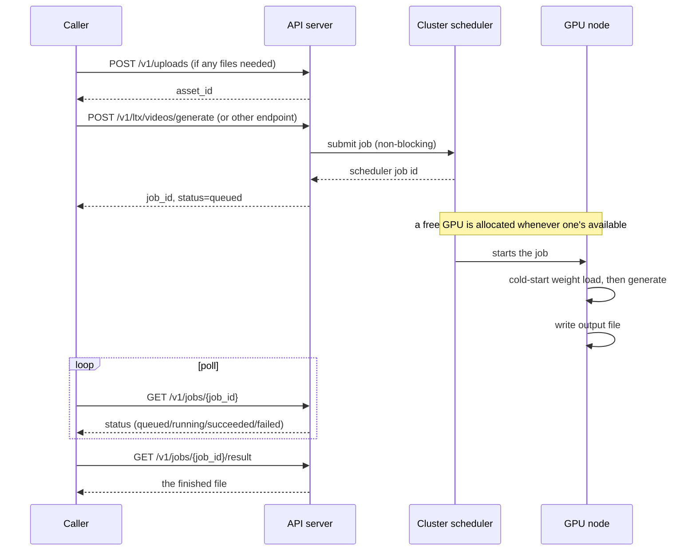

## LTX-2.3 -- text/image/audio-to-video and text-to-audio generation

This section is the prose companion to this backend's own endpoints -- it covers the model, the
prompting technique it responds to, and operational behavior a bare schema can't express on its
own. The endpoint reference generated below (straight from this server's own `/openapi.json`) is
still the source of truth for exact field names/types/validation; this section explains why those
fields exist and how to use them well.

### 1. What this is

LTX-2.3 (text/image/audio-to-video and text-to-audio generation) is one backend wired into this
API, which also hosts other GPU-cluster model backends under their own path prefixes (see the main
guide's "Overview"). Every endpoint specific to this backend lives under `/v1/ltx/...` (e.g.
`POST /v1/ltx/videos/generate`); job submission/tracking, file uploads, and downloads
(`/v1/uploads`, `/v1/jobs/...`) are shared infrastructure with no `/ltx` prefix, used the same way
regardless of which backend created the job -- see the main guide's "Jobs and timing" section.

Check `GET /v1/health` first to confirm the server is reachable.

Every generation request on this (and any) backend may also set an optional top-level `partition`
field to choose which Slurm partition its job submits to (e.g. `"main"` instead of the default).
Omit it, or name one that doesn't currently exist on the cluster, and the job silently falls back
to the API's default partition instead of erroring -- `GET /v1/health` reports which one that
currently is.

### 2. The model

LTX-2.3 is Lightricks' 22B-parameter diffusion transformer. Two things about it matter more than
usual for how you should use this API:

- **It generates video and audio *together*, in the same denoising process**, not video first with
  audio bolted on after. Cross-attention between the two modalities is why quoted dialogue in a
  prompt comes out lip-synced. Describe sound the same way you'd describe a visual: specific, timed
  to the action, not an afterthought tacked onto the end of the prompt.
- **Every request is an independent cold start.** There is no persistent, "warm" model sitting in
  GPU memory across requests. Each job you submit spins up its own allocation, loads the relevant
  checkpoints from network storage from scratch, generates, and tears the allocation back down. See
  §5 for what this means for timing.

Under the hood: Gemma 3 12B reads your prompt; the 22B transformer denoises video and audio jointly
at half the target resolution (stage 1), a spatial upsampler doubles that resolution in latent
space, and the transformer runs a short refinement pass at full resolution (stage 2). "Fast" mode
uses a distilled checkpoint with a fixed 8+3 step schedule and no guidance; "quality" mode uses the
full (non-distilled) checkpoint with classifier-free + spatio-temporal guidance, with a distilled
LoRA fused in at strength 0.8 for the stage-2 refinement pass. Everything runs in bf16 on a single
H100 80GB per job -- quality and fast mode never share the same GPU allocation, and the API never
runs two stages of one job on different hardware.

### 3. How a request flows

The `POST` call returns in well under a second -- it only submits the job, it never waits for
generation. Do not treat a slow `POST` response as meaningful; if it's slow, something is wrong
with the API process itself, not with generation.

### 4. Endpoint chooser

| Endpoint | Produces | Recipe | Key inputs |
|---|---|---|---|
| `POST /v1/ltx/videos/generate` | video (MP4) | fast **or** quality, your choice | `prompt`, optional `images` |
| `POST /v1/ltx/videos/keyframe-interpolation` | video (MP4) | quality only | `prompt`, `keyframes` (>=2) |
| `POST /v1/ltx/videos/audio-to-video` | video (MP4) | quality only | `prompt`, `audio_asset_id` |
| `POST /v1/ltx/videos/retake` | video (MP4) | fast only | `video_asset_id`, `prompt`, `start_time`, `end_time` |
| `POST /v1/ltx/audio/generate` | audio (WAV) | (dev checkpoint, no fast variant) | `prompt` |

"Quality only" / "fast only" above are not arbitrary choices this API made -- they reflect which
checkpoint variant the underlying pipeline actually ships with. There's no way to get a fast
keyframe-interpolation or a quality retake today; see §12 if that matters for what you're doing.

MP4 outputs are H.264 video + AAC audio, muxed together. WAV output is 16-bit PCM at the model's
native sample rate.

### 5. Job lifecycle and polling

Status values: `queued` -> `running` -> `succeeded` or `failed`. There is no progress percentage or
step count while `running` -- poll every **10-15 seconds**; polling faster wastes calls for no
benefit, since every job takes minutes at an absolute minimum.

**Timing, from real measurements, not estimates:**

| Run | Resolution | Duration | Node wall time |
|---|---|---|---|
| Fast, live end-to-end test on this deployment | 1920x1088 | 3s (73 frames) | 7m09s |
| Fast, internal benchmark | 1536x1024 | 5s (121 frames) | ~3m40s |
| Quality, internal benchmark | 1536x1024 | 5s (121 frames) | ~4m43s |

The gap between the two fast numbers is resolution, not measurement noise: 1920x1088 (this API's
default) is ~33% more pixels than 1536x1024, and cost scales worse than linearly with resolution.
**Budget at least 5-8 minutes per request**, and that's before any queue wait, which has no fixed
upper bound on a shared, busy cluster -- a request can sit `queued` for a while before a GPU frees
up. Roughly 90% of that time is loading model weights from network storage, not actual denoising
compute; this is a known, accepted characteristic of the current deployment, not a bug (see §12).

Each job is killed if it runs past its own wall-clock time limit (30 minutes by default on this
deployment). Jobs run on a pre-emptible partition by default, so a job can occasionally be killed
by higher-priority cluster work through no fault of your request -- this surfaces as
`status: "failed"` with an `error` message that says as much. **The correct response to a
pre-emption failure is to resubmit the exact same request unchanged**, not to treat it as a bad
input.

`DELETE /v1/jobs/{job_id}` cancels a job that hasn't finished. It's a best-effort no-op (not an
error) if the job already finished either way, so it's always safe to call if you're ever unsure.
`DELETE /v1/jobs/{job_id}/purge` permanently deletes a job that has already finished, along with any
uploaded input no other job still uses -- this cannot be undone.

### 6. Uploads

`POST /v1/uploads` once per file, before submitting a generation request that needs it. Cap:
{{upload_mb}} MB per file. Uploaded files are **not** automatically deleted -- only finished job
outputs expire ({{job_retention_days}} day(s) after they finish, on this deployment). Re-uploading
the same bytes twice produces two different `asset_id`s; there's no dedup.

Images are decoded and forced to RGB (the first 3 channels of whatever a standard image library
returns) before use. Standard RGB JPEG/PNG works reliably; grayscale or palette-mode images may not
convert the way you'd expect -- convert to RGB yourself before uploading if you're not sure.

### 7. Video/audio shape rules

- `height`/`width` must each be a **multiple of 64**. This is enforced by the pipeline on the GPU
  node, not by this API's request validation -- a bad value is accepted at submission time and
  only fails once a job is already running (wasting a GPU allocation and several minutes). Stick to
  `orientation` (`landscape` = 1920x1088, `portrait` = 1088x1920) unless you specifically need a
  different size, and if you do set explicit `height`/`width`, check the multiple-of-64 rule
  yourself first.
- Frame count must satisfy `8k+1` for some integer `k >= 1`. Using `duration_seconds` handles this
  for you (rounds to the nearest valid count); an explicit `num_frames` that doesn't satisfy this is
  silently snapped to the nearest valid value, which means the video you get may not be exactly the
  length you asked for by a fraction of a second.

  | duration_seconds | frames (24fps) |
  |---|---|
  | 3 | 73 |
  | 5 | 121 |
  | 8 | 193 |
  | 10 | 241 |

- `POST /v1/ltx/videos/retake`'s source video (`video_asset_id`) must **already** have `8k+1`
  frames and width/height that are multiples of 32 -- this is a constraint on files you upload for
  retake specifically, not something the API generates for you or checks before submission. A
  source video that came out of `POST /v1/ltx/videos/generate` on this same API already satisfies
  it; an arbitrary video you upload from elsewhere might not.

### 8. Prompting guide

LTX-2.3 responds to **cinematographic, chronological natural-language description**, not keyword
lists or tags. This is the same guidance Lightricks documents for the model generally, adapted here
for API use.

**Structure**, roughly in this order, as one flowing paragraph:
1. Main action, in a single clear sentence.
2. Specific movements and gestures.
3. Character/object appearance (only what's relevant -- don't over-describe things a viewer
   wouldn't notice).
4. Background and environment.
5. Camera angle and movement (**omit this entirely if you don't want camera motion** -- the model
   will invent some if you don't specify "static camera" or similar, but won't invent aggressive
   motion you didn't ask for).
6. Lighting and color.
7. Any mid-scene changes or events, described chronologically with connectors like "as", "then",
   "while".

Keep it to roughly 200 words or fewer. Use present-progressive verbs ("is walking", "speaking")
rather than static description of an action. Prefer restrained, plain language over intensified
adjectives -- "red dress" over "vibrant crimson dress", "soft overhead light" over "blinding
light". An optional `Style: <style>, ...` prefix sets an overall visual style
("cinematic-realistic", "anime", etc.); omit it if you don't need one.

**Audio**: describe it specifically and chronologically alongside the visual action it belongs to
-- "soft footsteps on tile as she crosses the room", not a vague "ambient sound" appended at the
end. For speech, put the **exact words in double quotes** together with a description of the
voice: *"the man says in a low, gravelly voice, 'You won't believe what I just saw.'"* The model
will lip-sync generated video to whatever dialogue you write, so don't write dialogue you don't want
spoken aloud in the output.

**Do not** use scene-cut language, timestamps, or phrases like "the video starts with..." -- the
model generates one continuous shot, and asking for cuts produces unreliable results.

#### Per-endpoint prompting notes

- **Image-to-video** (`images` on `/v1/ltx/videos/generate`): describe only what *changes* from the
  attached image (new motion, new dialogue). Re-describing static details already visible in the
  image can cause the model to "correct" toward your text and drift away from the actual photo.
- **Keyframe interpolation**: describe the *motion connecting* the keyframes, not their static
  appearance -- the images already establish that.
- **Audio-to-video**: describe the visible speaker/scene that should match the given audio (who's
  speaking, their appearance, the setting) -- not the audio's own content, which is fixed and
  passed through unchanged.
- **Retake**: describe only the content of the replaced `[start_time, end_time]` window, written as
  if it were the whole prompt for a short standalone clip -- not the surrounding video that's
  preserved as-is.
- **Text-to-audio**: describe the soundscape itself -- sources, timing, character (e.g. "a quiet
  rainforest at dawn: distant bird calls, a light breeze through leaves, the occasional drip of
  water from wet foliage").

#### Other prompt-related fields

- `negative_prompt` **replaces** the pipeline's own built-in default negative prompt rather than
  adding to it -- omit it to keep the (fairly comprehensive) built-in one. It's only honored in
  "quality" mode on `/v1/ltx/videos/generate` and always honored on the other quality-recipe
  endpoints (keyframe-interpolation, audio-to-video); "fast" mode ignores it entirely, silently.
- `enhance_prompt` (only on `/v1/ltx/videos/generate`) has an LLM rewrite your prompt into a richer
  one before generation. Useful for a short/vague input prompt; less useful if you've already
  written a detailed, structured prompt per the guidance above -- the enhancer is tuned to *add*
  detail, not preserve an already-detailed prompt unchanged. **The rewritten prompt is not returned
  anywhere in the API response**, so you can't inspect what was actually used (see §12).
- `seed`: identical seed + identical every other field = identical output. Vary the seed (not the
  prompt) to get a different take on the same idea.

#### Worked examples

Text-to-video (fast, no dialogue):
> A golden retriever puppy runs across a sunlit lawn, tongue out, tail wagging, chasing a bright
> yellow tennis ball. Bright daylight, shallow depth of field, handheld camera following the puppy.

Text-to-video (quality, with dialogue and a style prefix):
> Style: cinematic-realistic. A woman in a cream turtleneck sits at a café table by the window,
> holding a white ceramic cup. She smiles and says in a warm, clear voice, "I think we're right on
> time." Soft ambient café chatter and the quiet hiss of an espresso machine in the background.

### 9. Choosing parameters

- Use **fast** mode while iterating on a prompt or seed; switch to **quality** for a final take
  once you're happy with the composition -- quality costs meaningfully more per request (§5), so
  don't default to it for exploratory generation.
- There is no "variations" or batch endpoint. To compare several seeds of the same prompt, submit
  several separate `/v1/ltx/videos/generate` requests with different `seed` values -- each is a
  fully independent job on its own GPU allocation (see §11 before doing this at any scale).

### 10. Errors and recovery

| Signal | Meaning | What to do |
|---|---|---|
| `422` at submission | Request failed schema validation (e.g. conflicting fields) | Fix the request body; the `detail` array names the exact field/rule |
| `400` at submission | An `asset_id` you referenced doesn't exist | Re-check the `asset_id` from your `POST /v1/uploads` response |
| `429` at submission | Optional concurrency cap reached (not set on every deployment) | Wait and retry; this is not a per-request problem |
| `502` at submission | The job scheduler itself rejected the job (cluster-side) | Retry once; escalate to the operator if it persists |
| Job `status: "failed"`, `error` mentions pre-emption / SIGTERM / exit 137/143 | Killed by a higher-priority job on a shared partition | Resubmit the identical request; not a bad-input problem |
| Job `status: "failed"`, `error` mentions the source video's shape (retake) | The uploaded video doesn't satisfy retake's frame-count/resolution constraints (§7) | Use a video produced by this API, or re-encode to match |
| Job `status: "failed"`, other reasons | Likely a real problem (OOM, bad checkpoint state, etc.) | Don't blindly retry in a loop |
| `409` on `/result` | Job hasn't succeeded yet | Check `/v1/jobs/{job_id}` first; only fetch `/result` after `status: "succeeded"` |
| `410` on `/result` | Result expired and was cleaned up | Nothing to recover; resubmit if the content is still needed |

### 11. Shared-cluster etiquette

Every job you submit consumes one full H100 GPU on a cluster shared with other users and workloads,
for several minutes minimum. A few consequences:

- Don't submit large batches of speculative requests "just in case" -- each one is a real,
  non-trivial cost, not a cheap API call.
- Prefer fewer, well-considered prompts over many quick variations, especially in quality mode.
- If you're generating on behalf of an interactive user, it's reasonable to let them know expected
  wait time (§5) rather than silently blocking.

### 12. Known limitations

- No fast/distilled variant exists for keyframe-interpolation or audio-to-video -- every call to
  those two endpoints pays the slower quality cost.
- Height/width and retake-source shape constraints (§7) aren't validated at submission time, only
  discovered after a job is already running.
- The prompt actually used after `enhance_prompt` rewriting is never returned, so it can't be
  inspected or reused.
- This backend's own jobs don't report fine-grained `progress` (only some other backends do -- see
  the main guide's "Jobs and timing" section); `status` is the only signal while a job runs.
- The underlying retake pipeline's own video-only/audio-only flags aren't exposed by
  `/v1/ltx/videos/retake` -- it always regenerates both.
- Guidance scales (CFG/STG) and step counts are fixed pipeline defaults, not exposed as request
  fields, on any endpoint.
- Uploaded assets are never automatically cleaned up (unlike job outputs).
- Every request cold-starts (see §2, §5) -- there's no warm/resident model option today.
- Two additional pipelines the underlying model supports (dubbing an existing video's dialogue, and
  general reference-image-conditioning control) aren't wired into this API yet.